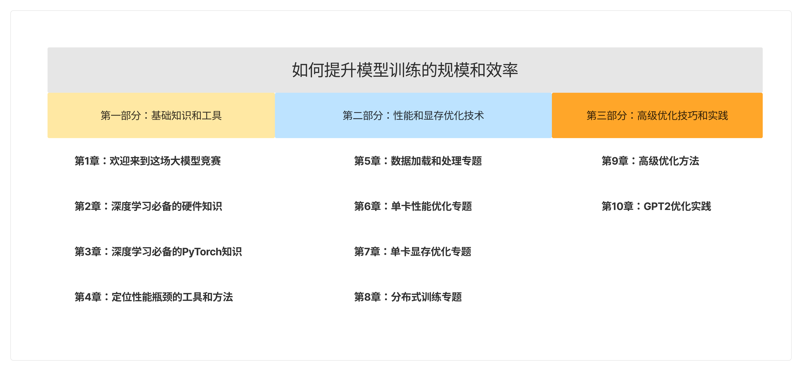

# Efficient Training in PyTorch


## 简介
本仓库包含了实体书《大模型动力引擎——PyTorch性能与显存优化手册》中各个章节所用到的代码示例。该书由张爱玲 ([@ailzhang](https://github.com/ailzhang)) 和杨占略 ([@jim19930609](https://github.com/jim19930609)) 编写，清华大学出版社于2024年10月出版发行。


<div style="text-align: center;">
  <p style="text-align: center;">《大模型动力引擎——PyTorch性能与显存优化手册》章节结构</p>
  
</div>

## Intro
This is the public repo for code snippets in book "Efficient training in PyTorch" by Ailing Zhang([@ailzhang](https://github.com/ailzhang)) and Zhanlue Yang([@jim19930609](https://github.com/jim19930609)). The book is structured in 3 sections:
1. **Foundation**: this section covers the essential knowledge  of hardware, software and profiling tools, including:
- Intro to concepts like GPU compute/memory, CPU, networking etc.
- PyTorch fundamentals like tensors, operations, async GPU/CPU execution, dynamic graphs, autograd etc and how they work.
- How to set up a benchmark environment and accurately measure time with async CPU/GPU computation.
- How to interpret PyTorch profiler results to identify bottlenecks.
2. **Common problems and techniques**: this section delves into:
- Improving data loading speed, such as using multiprocessing dataloaders and prefetching, and diagnosing bottlenecks via tools like htop and iotop.
- Speeding up computation on a single GPU.
- Reducing RAM usage on a single GPU.
- Distributed training strategies, including data parallelism, tensor parallelism, and pipeline parallelism.
3. **Advanced techniques**: the final section covers:
- Techniques like Automatic Mixed Precision, custom CUDA kernels, and compiler-based optimizations like torch.dynamo.
- An example where we optimize the [minGPT codebase](https://github.com/karpathy/minGPT), showing step-by-step how to improve GPU memory usage and performance using the techniques discussed in previous chapters.

> Please note that the book is currently written and published in Chinese, and there is no English version available yet. If you’re interested in an English edition, feel free to let us know by creating an issue.

## Repo layout

- The folder structure mirrors the chapters of the book, with code samples arranged in the order they appear in each chapter.
- Profiling results are located in the `traces` subfolders within each chapter’s directory. Please note that the profiling results may differ depending on your specific software and hardware setup.
- For chapter 10, the `main` branch contains a modified version of the vanilla minGPT code. Memory optimizations are located in the `chapter10_memory` branch, and performance optimizations in the `chapter10_perf` branch. Each commit corresponds to a specific technique discussed in the book.


## Code format
1. Please make sure `pre-commit` is installed and feel free to add rules.
```
pip install pre-commit
pre-commit install
```
